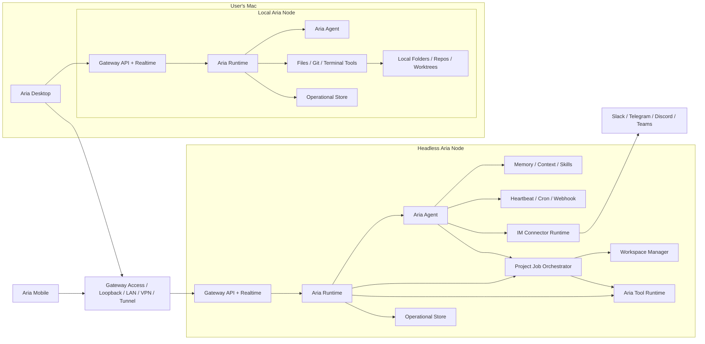

# Deployment Model

This page defines where each major component runs and how clients reach it.

The deployable execution boundary is `Aria Node`.

## Deployment Diagram

## Supported Deployment Modes

### 1. Desktop node on the current Mac

The user runs `Aria Desktop` on a Mac. Desktop supervises or attaches to a
local Aria node.

- `Aria Agent` lives on `This Mac`
- local project execution uses native Aria tools
- local gateway defaults to loopback
- IM connectors can be enabled later when Desktop is expected to stay online
- remote handoff is optional because local work already runs on a node

This is the default local-first model.

### 2. Headless node on a home or office machine

The user runs Headless Aria on a Mac mini, workstation, or home server.

- same Aria node composition
- better for always-on IM connectors and automation
- better for remote job availability
- Desktop and Mobile connect to it through the gateway

### 3. Headless node on cloud or managed infrastructure

The user runs Headless Aria on a VPS, bare-metal server, or managed host.

- same architecture as the home or office headless node
- better network reachability when the operator chooses to publish it
- suitable for durable remote jobs and mobile continuation

## Placement Matrix

| Capability                                 | Desktop node    | Headless node               | Mobile         | External network infra |
| ------------------------------------------ | --------------- | --------------------------- | -------------- | ---------------------- |
| `Aria Agent`                               | yes             | yes                         | no             | no                     |
| Aria-managed memory/context                | yes             | yes                         | no             | no                     |
| IM connectors                              | optional        | yes                         | no             | no                     |
| heartbeat / cron / webhook                 | optional        | yes                         | no             | no                     |
| project control for Aria-managed workflows | yes             | yes                         | no             | no                     |
| project jobs                               | local node jobs | durable remote jobs         | no             | no                     |
| local repo/worktree access                 | yes, on the Mac | only for repos on that host | no             | no                     |
| Aria chat UI                               | yes             | via clients or console      | yes, as client | no                     |
| remote project UI                          | yes             | not primary                 | yes            | no                     |
| reachability / publishing                  | no              | no                          | no             | yes                    |

## Connectivity Modes

### Direct secure connection

The client reaches an Aria node directly.

Typical examples:

- same machine loopback
- same LAN
- VPN
- Tailscale
- direct public endpoint with gateway auth

### Published gateway connection

The client reaches an Aria node through an operator-managed network path that
still terminates at the built-in gateway.

Typical examples:

- Cloudflare Tunnel
- Caddy / Nginx / Traefik reverse proxy
- a cloud load balancer in front of the node

See [../surfaces/gateway-access.md](../surfaces/gateway-access.md) for the
detailed security model.

## Failure and Disconnect Model

### Desktop node

- local project jobs depend on the current Mac staying awake and online
- IM connectors hosted by Desktop stop when the local node is unavailable
- the UI should make local availability explicit before connectors or long jobs are enabled

### Headless node

- Aria chat, connectors, automation, and project jobs continue while clients disconnect
- inbox state and approvals remain durable on the node
- client reconnection reattaches to thread and run state

### Handoff

- handoff moves a project thread from one node environment to another
- Git branch transfer is preferred
- patch bundles are the fallback when no shared remote is available
- every handoff creates a durable thread/environment binding event

## Security Boundary

The core security boundary is node ownership.

### Desktop node boundary

Desktop-node project work can touch local files, git state, and terminals only
through explicit Aria tool policy. The local node may host memory and
connectors, but those capabilities remain node-owned and audited.

### Headless node boundary

A headless node owns:

- Aria memory
- connector tokens
- automation definitions
- workspace state
- project job execution
- canonical thread and run records for work hosted there

### External network boundary

VPNs, tunnels, reverse proxies, and load balancers may publish Aria Gateway, but
they must not become the owner of Aria memory, automations, approvals, or
assistant semantics.

## Naming Guidance

Deployment language should stay precise:

- say `Aria Node` when you mean a deployed execution host
- say `Desktop node` when the node is hosted by Aria Desktop on the current Mac
- say `Headless Aria` when the node runs without desktop UI
- say `Aria Runtime` when you mean the internal runtime kernel
- say `Aria Console` when you mean the node-local `aria` terminal UI
- say `Aria Desktop` when you mean the desktop app
- say `Aria Gateway` when you mean the authenticated API + realtime entrypoint
- say `external network path` when you mean Tailscale, Cloudflare Tunnel, reverse proxy, or another operator-managed reachability layer
