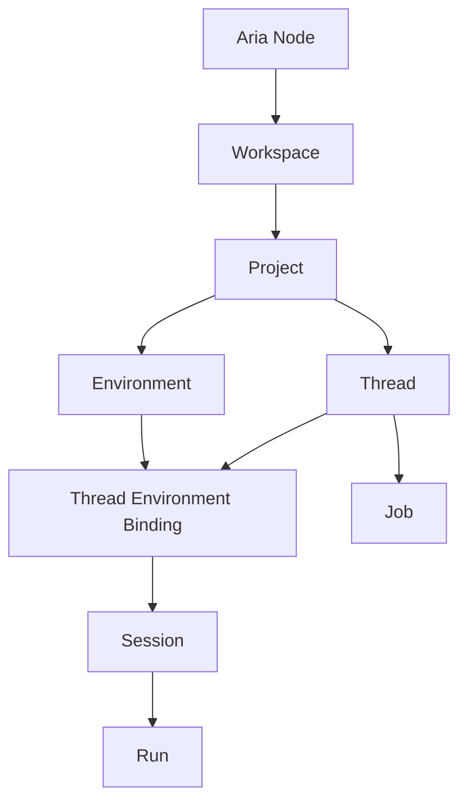

# Domain Model

This page defines the persistent and protocol-facing object model for the canonical architecture.

## Core Hierarchy

## Canonical Entities

| Entity                       | Meaning                                                                                    |
| ---------------------------- | ------------------------------------------------------------------------------------------ |
| `node`                       | An `Aria Node` deployment boundary such as `This Mac` or a headless server                 |
| `workspace`                  | An execution boundary inside a node                                                        |
| `project`                    | A repo, folder, or logical work unit inside a workspace                                    |
| `environment`                | A concrete execution target such as `main`, worktree, or sandbox                           |
| `thread`                     | A user-visible conversation or job surface                                                 |
| `thread_environment_binding` | The current or historical attachment between a project thread and an execution environment |
| `session`                    | Runtime continuity object backing a thread                                                 |
| `run`                        | One model/tool execution inside a session                                                  |
| `job`                        | A durable long-running execution owned by a thread                                         |
| `automation`                 | A node-owned recurring or event-triggered job spec                                         |
| `memory_record`              | Durable assistant memory owned by `Aria Agent`                                             |
| `connector_account`          | A bound IM integration account                                                             |
| `approval`                   | Pending operator approval item                                                             |
| `audit_event`                | Durable security and action trail record                                                   |

## User-Facing vs Runtime Terms

| User-facing term    | Runtime term                   | Notes                                                                                        |
| ------------------- | ------------------------------ | -------------------------------------------------------------------------------------------- |
| Thread              | `thread` + `session`           | The user sees a thread, the runtime still needs session continuity                           |
| Active environment  | `thread_environment_binding`   | The UI can show an environment switch without making environments the primary sidebar object |
| Remote job          | `job` + `run`                  | Jobs may span many runs                                                                      |
| Project environment | `environment`                  | Includes main branch, worktree, or sandbox                                                   |
| Aria chat           | `thread` bound to `Aria Agent` | Node-hosted                                                                                  |

The UI should prefer `thread` over `session`.

## Ownership Matrix

| Entity                       | Desktop node | Headless node | Mobile | Notes                                                 |
| ---------------------------- | ------------ | ------------- | ------ | ----------------------------------------------------- |
| `node`                       | yes          | yes           | no     | Mobile attaches to nodes but does not host one        |
| `workspace`                  | yes          | yes           | no     | Workspaces belong to the node that can execute them   |
| `project`                    | yes          | yes           | cache  | Project records are canonical on the hosting node     |
| `environment`                | yes          | yes           | cache  | Local worktree, remote worktree, or sandbox on a node |
| `thread`                     | yes          | yes           | cache  | Thread identity can move by explicit handoff          |
| `thread_environment_binding` | yes          | yes           | cache  | Needed to support explicit environment switching      |
| `session`                    | yes          | yes           | no     | Runtime-internal continuity object                    |
| `run`                        | yes          | yes           | cache  | Execution record                                      |
| `job`                        | yes          | yes           | cache  | Long-running work is most durable on headless nodes   |
| `automation`                 | optional     | yes           | no     | Node-owned                                            |
| `memory_record`              | yes          | yes           | no     | Aria-managed memory is node-owned                     |
| `connector_account`          | optional     | yes           | no     | Node-owned                                            |
| `approval`                   | yes          | yes           | cache  | Canonical state lives on the hosting node             |
| `audit_event`                | yes          | yes           | cache  | Canonical state lives on the hosting node             |

## Thread Types

The system should model thread type explicitly.

| Thread type      | Agent        | Host         |
| ---------------- | ------------ | ------------ |
| `aria`           | `Aria Agent` | Aria node    |
| `connector`      | `Aria Agent` | Aria node    |
| `automation`     | `Aria Agent` | Aria node    |
| `remote_project` | `Aria Agent` | remote node  |
| `local_project`  | `Aria Agent` | desktop node |

## Agent Assignment

Every runtime-managed thread is handled by `Aria Agent`.

Examples:

- `aria` -> `aria-agent`
- `remote_project` -> `aria-agent` on the selected remote node
- `local_project` -> `aria-agent` on the desktop node

The selected node and environment determine where the run executes. The system
does not expose external coding agents as primary project workers.

## Project Management By Aria

`Aria Agent` manages and executes project work through Aria Runtime tools.

Recommended split:

- `Aria Agent` owns project-management intent, planning, coordination, execution, and summaries
- Aria Runtime owns concrete runs, tool execution, policy, approvals, and audit
- `Projects Control` owns thread/environment dispatch rules

This keeps project work inside one Aria-native execution model.

## Recommended Identity Fields

Every persisted record and every streamed event should carry as much of this identity as is available:

- `serverId`
- `nodeId`
- `workspaceId`
- `projectId`
- `environmentId`
- `threadId`
- `sessionId`
- `runId`
- `jobId`
- `taskId`
- `agentId`
- `actorId`

## Event Correlation

### Minimum event identity

For node-hosted work:

- `nodeId`
- `threadId`
- `sessionId`
- `runId`
- `agentId`

For remote project jobs:

- `nodeId`
- `workspaceId`
- `projectId`
- `environmentId`
- `threadId`
- `jobId`
- `runId`
- `agentId`

For local project work:

- `threadId`
- `projectId`
- `environmentId`
- `runId`
- `agentId`

`@aria/protocol` should own the normalization and assembly of these streamed event envelopes so gateway/runtime code only supplies event payloads plus correlation metadata.

## Storage Recommendations

The new store shape should separate assistant state from project execution state without inventing separate storage systems for everything.

Recommended top-level logical groups:

- `nodes`
- `workspaces`
- `projects`
- `environments`
- `threads`
- `thread_environment_bindings`
- `sessions`
- `runs`
- `jobs`
- `automations`
- `automation_runs`
- `memory_records`
- `connector_accounts`
- `approvals`
- `audit_events`
- `checkpoints`

## Isolation Rules

### Aria isolation

`Aria Agent` threads can use:

- Aria memory
- skills
- connectors
- automation

### Project isolation

Project threads can use:

- project-scoped files
- Aria Runtime coding tools
- local or remote environment execution

Project threads must not silently inherit Aria-managed memory. If Aria is involved, the handoff must be explicit.

## Environment Switching Rules

To support a unified project sidebar with environment switching in the thread view:

1. a project thread belongs to a `project`, not directly to an `environment`
2. the thread has one active `thread_environment_binding`
3. switching environments creates a durable binding event or new binding record
4. each run stores the concrete environment it used
5. the UI may present the switch inline without losing auditability

## Explicit Handoff

When project work moves between nodes, the client or runtime should create a
deliberate handoff event or linked thread reference rather than blurring the
ownership of the active execution environment.
