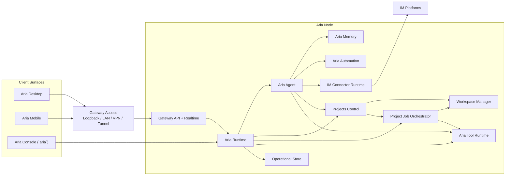

# Architecture Overview

The Aria architecture is moving to one deployable execution boundary:
`Aria Node`.

An `Aria Node` runs `Aria Runtime`, `Aria Agent`, policy, tools, audit, durable
state, and the authenticated gateway. `Aria Desktop` can include a local Aria
node, while headless deployments run the same node composition without a
desktop UI.

The most important rule is:

`Aria Agent` runs on `Aria Node`.

Clients attach to nodes. Mobile remains a thin client.

## Product Surfaces

| Surface         | Role                                                                                                              |
| --------------- | ----------------------------------------------------------------------------------------------------------------- |
| `Aria Node`     | Hosts `Aria Agent`, runtime, tools, memory, audit, gateway, optional IM connectors, automations, and project jobs |
| `Aria Desktop`  | Primary Mac operator app; includes a local Aria node and can connect to remote nodes                              |
| `Headless Aria` | Server deployment of an Aria node without the desktop UI                                                          |
| `Aria Mobile`   | Thin client for chat, inbox, approvals, automations, and remote project jobs                                      |
| `Aria Console`  | Node-local terminal UI for chatting directly with `Aria Agent`                                                    |

## Architectural Principles

1. `Aria Agent` is the only user-facing agent.
2. `Aria Agent` handles assistant and coding work through Aria Runtime tools.
3. Project execution is an Aria-native coding run, not a handoff to external coding agents.
4. Desktop and headless deployments share the same node composition wherever possible.
5. IM connectors and automations are node-hosted runtime surfaces.
6. Mobile stays thin and never hosts `Aria Agent`, connectors, automations, or project execution.
7. The same identity model spans chat, jobs, automation, approvals, and audit.
8. `Aria Gateway` is the secure node boundary; VPNs, tunnels, and reverse proxies are operator-managed infrastructure rather than Aria product surfaces.

## System Landscape

## Node Modes

| Mode            | Hosted by                                           | What lives there                                                                           |
| --------------- | --------------------------------------------------- | ------------------------------------------------------------------------------------------ |
| `Desktop node`  | `Aria Desktop` on the user's Mac                    | local Aria agent, runtime, store, gateway, local project execution, optional IM connectors |
| `Headless node` | server, VPS, Mac mini, workstation, or managed host | always-on Aria agent, gateway, connectors, automations, remote project jobs                |
| `Mobile client` | `Aria Mobile`                                       | remote view and control of node-hosted threads, jobs, approvals, and artifacts             |

The desktop product still presents the same top-level spaces:

- `Projects`
- `Chat`

`Chat` is for Aria conversations without an attached working directory.
`Projects` is for threads that carry a workspace, repository, worktree, or
execution environment. Both spaces attach to an Aria node. `This Mac` is simply
the default local node when Desktop is running.

## UI Direction

Desktop and mobile should use a shared interaction model:

- one unified project-thread sidebar
- a central conversation and run stream
- a contextual right-side pane for reviews, diffs, environment details, or task state
- mobile layouts that preserve the same thread model while collapsing secondary panels into sheets or stacked views

The right product split for Aria remains:

- `Projects`
- `Chat`

not a generic flat sessions-only surface.

## Top-Level Responsibility Split

### `Aria Node`

- runs `Aria Agent`
- stores canonical Aria memory and context for that node
- owns IM connectors configured on that node
- owns automation configured on that node
- owns project control for Aria-managed project workflows
- hosts project jobs for environments attached to that node
- stores durable run, thread, audit, and checkpoint state for node-hosted work
- exposes the authenticated gateway

### `Aria Desktop`

- renders the primary operator UI
- starts or attaches to the local node on `This Mac`
- connects to one or more remote Aria nodes
- provides local filesystem, git, and worktree access to the local node under policy
- stores UI state and client-side caches without redefining runtime execution semantics

### `Headless Aria`

- runs the same Aria node composition without a desktop UI
- is the preferred always-on host for IM connectors, automations, and remote jobs
- exposes the same gateway and interaction protocol as the desktop node

### `Aria Mobile`

- renders mobile chat, inbox, approvals, automation, and remote project surfaces
- never hosts `Aria Agent`
- never owns Aria-managed memory or automation
- never hosts project execution

### Gateway access

- every Aria node exposes its built-in `Gateway API + Realtime`
- operators decide whether that gateway is reachable over loopback, LAN, VPN, or a published tunnel/proxy
- external network infrastructure handles reachability, TLS termination, and routing
- assistant behavior, auth, approvals, and runtime state remain on the Aria node

## Hard Boundary Rules

The following rules are architectural, not optional UX choices.

### Node-hosted features

- `Aria Agent`
- Aria-managed memory and context
- skill management for Aria
- IM connectors
- heartbeat / cron / webhook automation
- project control for Aria-managed project workflows
- project job orchestration
- inbox and approvals

### Desktop responsibilities

- render local and remote node state
- supervise the local node when Desktop owns it
- expose local filesystem, git, and worktree capabilities to the local node under explicit policy
- connect to remote nodes for handoff and remote continuation

### Forbidden combinations

- no external coding-agent delegation in runtime-managed project execution
- no IM connectors bound directly to client-only thread state
- no mobile-hosted Aria Agent
- no mobile-hosted project execution

## North-Star User Experience

### Aria

The user can:

- chat with `Aria Agent`
- review inbox items
- manage automations
- view IM connector conversations
- manage projects through Aria
- approve or reject node-hosted actions

### Projects

The user can:

- open a project once in a unified sidebar
- keep project threads visible without splitting local and remote into separate trees
- switch the active execution environment in the thread view
- choose between `This Mac` and remote Aria nodes
- let Aria create, monitor, and continue project work
- hand off a thread to another node without losing thread identity
- disconnect and reconnect without losing remote job state

## Recommended Reading

- [deployment.md](./deployment.md)
- [../surfaces/server.md](../surfaces/server.md)
- [../surfaces/desktop-and-mobile.md](../surfaces/desktop-and-mobile.md)
- [domain-model.md](./domain-model.md)
- [packages.md](./packages.md)
