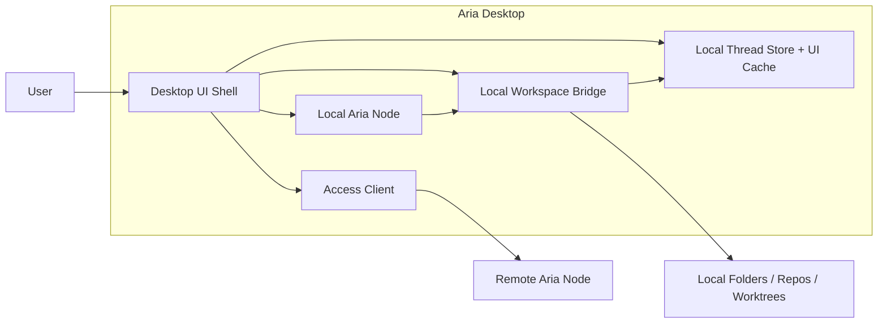
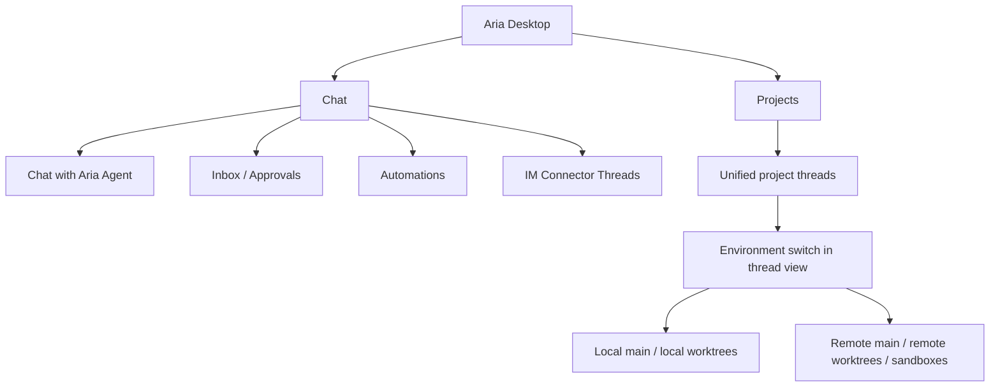
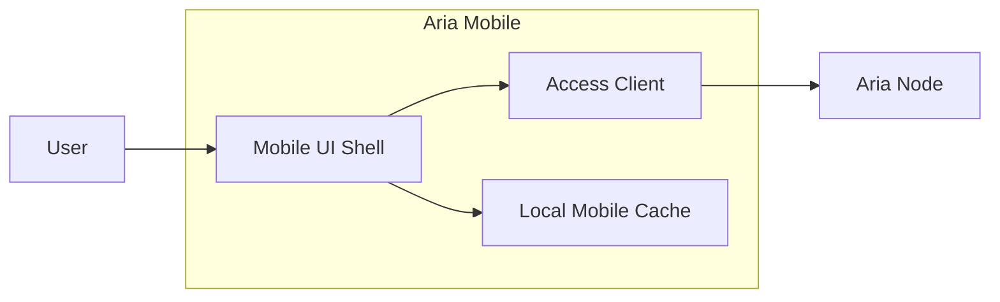

# Aria Desktop And Aria Mobile

This page defines the client-side architecture.

## Aria Desktop

`Aria Desktop` is the primary operator client. It owns the desktop UI and can
supervise a local Aria node on the current Mac.

It has two node attachment modes:

- `This Mac`, the local Desktop node
- remote headless Aria nodes

## Recommended Client Toolchain

Aria should standardize the client and shared-package toolchain on the broader VoidZero stack while using `Vite+` for monorepo management and `bun` as the selected package manager/runtime where supported.

Recommended baseline:

- `bun` as selected package manager/runtime under Vite+
- `Vite+` where a unified client/web toolchain is applicable
- `Vite` for dev-server and ecosystem compatibility
- `Rolldown` for builds and packaging
- `Oxc` for linting, formatting, and related language tooling
- `Vitest` for tests

This gives Aria:

- one coherent client and shared-package toolchain
- fast local development and CI
- good monorepo ergonomics
- strong support for AI-assisted workflows

For the concrete shell decisions, see [../core/tech-decisions.md](../core/tech-decisions.md).

## Desktop Component Diagram



## Desktop Responsibilities

| Component                       | Responsibility                                                                                                           |
| ------------------------------- | ------------------------------------------------------------------------------------------------------------------------ |
| `Desktop UI Shell`              | Sidebar, thread views, project pickers, environment selection, approvals UI                                              |
| `Access Client`                 | Connects to local or remote Aria nodes through the built-in gateway over loopback, LAN, VPN, or a published tunnel/proxy |
| `Local Aria Node`               | Runs local Aria Runtime, Aria Agent, tools, store, gateway, and optional connector hosting on `This Mac`                 |
| `Local Workspace Bridge`        | Local filesystem, git, worktree, shell, and environment integration for the local node                                   |
| `Local Thread Store + UI Cache` | Local UI state and cache for node-hosted threads, runs, environments, and metadata                                       |

## Desktop Shell Recommendation

Recommended direction:

- React-based desktop UI
- `bun` for package management/runtime through Vite+
- VoidZero-stack toolchain for the renderer and shared UI packages
- desktop-native wrapper chosen separately from the renderer toolchain

The key architectural decision is the toolchain and package boundary, not a specific desktop wrapper first.

## Desktop Layout Model

Aria Desktop should use a three-pane productivity layout:

1. left sidebar for global navigation plus project/thread selection
2. center pane for the active thread stream
3. right-side contextual pane for review, changes, environment details, or task state
4. persistent bottom composer tied to the active thread

Recommended Aria layout:

```text
+---------------------------------------------------------------+
| Sidebar           | Active Thread                | Context    |
|                   |                              | Panel      |
| Chat              | header                       |            |
| Projects          |   thread title               | Review     |
|   Project A       |   environment switch         | Changes    |
|   Project B       |                              | Job State  |
|                   | stream                       | Artifacts  |
|                   |                              |            |
|                   | composer                     |            |
+---------------------------------------------------------------+
```

This layout fits both Desktop comments you raised:

- the sidebar does not split local and remote projects
- the environment switch lives in the active thread area, not in the tree

For the detailed desktop workbench design contract, interaction paths, and acceptance criteria, see [desktop-design.md](./desktop-design.md).

## Desktop Product Spaces



## Desktop Sidebar Model

The left sidebar should not force a local-vs-remote split for project threads.

Instead:

- keep `Projects` as one unified top-level space
- keep `Chat` as its own top-level space for threads without an attached working directory
- let each project thread choose its execution environment in the right-side thread view

The execution target is an environment property, not the primary sidebar grouping.

Recommended hierarchy:

```text
Projects
  <Project A>
    <Thread 1>
    <Thread 2>
  <Project B>
    <Thread 1>
    <Thread 2>

Chat
  Chat
  Inbox
  Automations
  Connectors
```

In the thread header or right-side chat area, the user should see an environment selector such as:

```text
Environment:
  This Device / main
  This Device / wt/feature-x
  Home Server / main
  Home Server / wt/fix-login
  Cloud Server / sandbox/pr-128
```

The context pane should also surface:

- current environment metadata
- active node
- job status
- review findings or diffs
- approvals or actions related to the current thread

## Desktop Thread Rules

### Chat threads

- always live on an Aria node
- always talk to `Aria Agent`
- can access Aria-managed memory and automation
- do not carry an attached project working directory

### Remote project threads

- are project threads currently attached to a remote node environment
- execute through `Aria Agent` and native runtime tools on that node
- can continue running when the desktop disconnects

### Local project threads

- are project threads currently attached to a local environment
- execute through `Aria Agent` and native runtime tools on the Desktop node
- use the Desktop node's Aria memory and policy

### Unified project threads

A project thread may move between environments over time, but that move should be explicit and recorded.

Recommended rule:

- the thread has one active environment attachment at a time
- changing the environment is a tracked event
- runs record the exact environment they executed against
- Aria can request or perform this switch through `Projects Control`

Recommended UX rule:

- preserve one thread identity while switching execution targets when the user is continuing the same unit of work
- prompt before switching when the environment change is materially risky, such as moving from local main to a remote sandbox or vice versa

## Aria Mobile

`Aria Mobile` is a thin node client.

It should not host project execution, connector runtimes, or local agent state.

## Mobile Component Diagram



## Mobile Responsibilities

- chat with `Aria Agent`
- review inbox items
- answer approvals and questions
- inspect automation state
- receive server-owned notifications and reconnect nudges
- review attachments and remote artifacts without taking ownership of them
- view project threads that are attached to remote environments
- reconnect to ongoing remote jobs

## Mobile Layout Model

Mobile should preserve the same conceptual structure as desktop, but collapse panels into stacked views and sheets.

Recommended model:

1. top-level tabs or navigation for `Projects` and `Chat`
2. thread list screen
3. active thread screen with:
   - thread header
   - environment switch
   - message/run stream
   - composer
4. review/details presented as:
   - bottom sheet
   - push screen
   - segmented detail view
5. notification and attachment affordances presented as remote-first detail surfaces rather than local device ownership

That keeps the thread model consistent across devices.

## Mobile Non-responsibilities

- no project execution
- no local repo or worktree management
- no Aria memory ownership
- no connector hosting
- no automation hosting

## Mobile Shell Recommendation

Mobile may need a native-oriented shell, but the monorepo should still use the same underlying client-tooling philosophy:

- bun at the repo/runtime layer where supported
- Oxc and Vitest across shared packages
- Rolldown-friendly package outputs for shared libraries where appropriate
- shared client contracts and UI packages with desktop as much as possible

## Client Access Layer

Both desktop and mobile should share the same access model:

- direct connection to an Aria node
- optional operator-managed VPN/tunnel/reverse-proxy path to the same Aria Gateway
- support for multiple nodes in one client
- a stable `nodeId` as the root identity boundary

## Recommended Internal Packages

| Responsibility              | Package or app                                        |
| --------------------------- | ----------------------------------------------------- |
| Desktop shell               | `apps/aria-desktop`                                   |
| Shared access client        | `@aria/access-client`                                 |
| Shared project client state | `@aria/work` or a dedicated client-facing slice of it |
| Local node supervision      | `@aria/server` plus the Desktop main process          |
| Local workspace integration | Desktop main process plus `@aria/workspaces`          |

## Current Repo Note

The desktop package/app surfaces on this page are live. Mobile remains a future client app and should not keep an empty app/package shell in the repo before implementation starts.

## Toolchain References

Official references:

- [Vite+](https://viteplus.dev/)
- [VoidZero](https://voidzero.dev/)

The VoidZero site describes Vite+ as the entry point that manages runtime, package manager, and frontend tooling, and positions Vite, Rolldown, Oxc, and Vitest as part of the same tooling family. Aria should adopt that toolchain direction while explicitly selecting `bun` as the package manager/runtime choice.

## Boundary Reminder

The desktop client can be powerful because it can supervise a local Aria node
without inventing a second execution model.

That means:

- desktop can run a local Aria node on `This Mac`
- desktop can render local and remote node-hosted Aria
- desktop must not route project work to external coding agents

It lets `Aria Agent` manage projects through:

- explicit project attachment
- explicit environment selection
- explicit desktop bridge access for local environments
