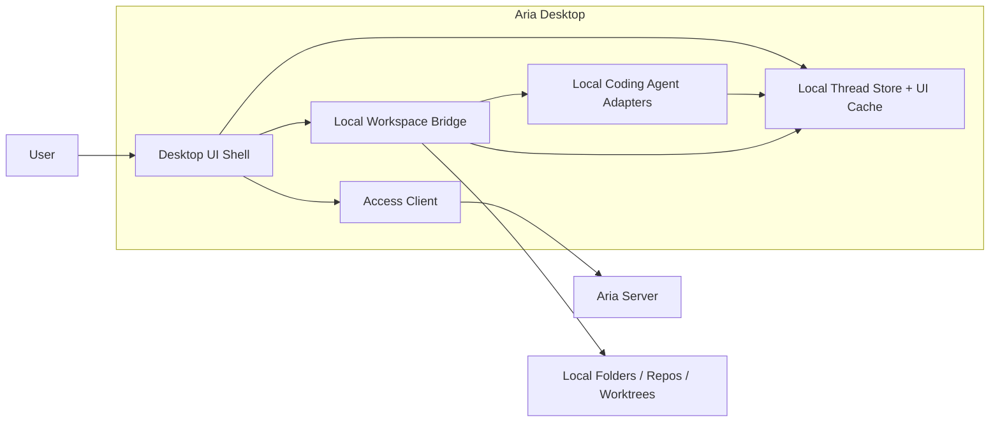
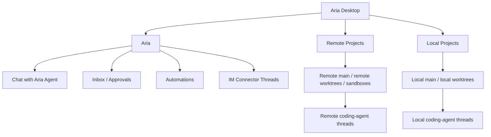
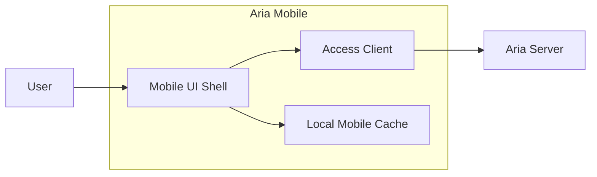

# Aria Desktop And Aria Mobile

This page defines the client-side architecture.

## Aria Desktop

`Aria Desktop` is the primary operator client. It has two fundamentally different execution modes:

- server-connected mode for `Aria` and `Remote Projects`
- local execution mode for `Local Projects`

## Desktop Component Diagram



## Desktop Responsibilities

| Component | Responsibility |
| --- | --- |
| `Desktop UI Shell` | Sidebar, thread views, project pickers, environment selection, approvals UI |
| `Access Client` | Connects to one or more `Aria Server` deployments directly or through relay |
| `Local Workspace Bridge` | Local filesystem, git, worktree, shell, and environment integration |
| `Local Coding Agent Adapters` | Codex, Claude Code, OpenCode on the current machine |
| `Local Thread Store + UI Cache` | Local project thread state, UI cache, local run history, server metadata cache |

## Desktop Product Spaces



## Desktop Sidebar Model

The left sidebar should group by execution ownership first, then by project structure.

Recommended hierarchy:

```text
Aria
  Chat
  Inbox
  Automations
  Connectors

Remote Projects
  <Server A>
    <Project>
      main
      wt/<name>
  <Server B>
    <Project>
      main
      sandbox/<name>

Local Projects
  <Local Repo or Folder>
    main
    wt/<name>
```

## Desktop Thread Rules

### Aria threads

- always live on an `Aria Server`
- always talk to `Aria Agent`
- can access Aria-managed memory and automation

### Remote project threads

- always live on an `Aria Server`
- always execute through remote coding agent adapters
- can continue running when the desktop disconnects

### Local project threads

- always live in the desktop-local execution plane
- use local coding agents
- do not automatically share Aria-managed memory

## Aria Mobile

`Aria Mobile` is a thin server client.

It should not host local project execution or local coding-agent subprocesses.

## Mobile Component Diagram



## Mobile Responsibilities

- chat with `Aria Agent`
- review inbox items
- answer approvals and questions
- inspect automation state
- view remote project threads
- reconnect to ongoing remote jobs

## Mobile Non-responsibilities

- no local coding agent execution
- no local repo or worktree management
- no Aria memory ownership
- no connector hosting
- no automation hosting

## Client Access Layer

Both desktop and mobile should share the same access model:

- direct connection to `Aria Server`
- optional relay-assisted connection through `Aria Relay`
- support for multiple servers in one client
- a stable `serverId` as the root identity boundary

## Recommended Internal Packages

| Responsibility | Package |
| --- | --- |
| Desktop shell | `@aria/desktop` |
| Mobile shell | `@aria/mobile` |
| Shared access client | `@aria/access-client` |
| Desktop local bridge | `@aria/desktop-bridge` |
| Local git integration | `@aria/desktop-git` |
| Local coding agent adapters | `@aria/agents-coding` or `@aria/desktop-agents` |
| Shared UI primitives | `@aria/ui` |

## Boundary Reminder

The desktop client can be powerful without becoming a second server.

That means:

- desktop can run local project workers
- desktop can render server-hosted Aria
- desktop must not become the host of `Aria Agent`
