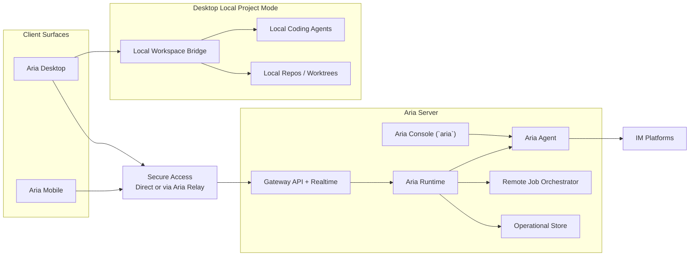

# New Architecture Overview

The new Aria architecture separates the system into one server-hosted assistant platform and multiple client surfaces.

The most important rule is simple:

`Aria Agent` runs only on `Aria Server`.

Everything else follows from that.

## Product Surfaces

| Surface | Role |
| --- | --- |
| `Aria Server` | Hosts `Aria Agent`, remote project jobs, IM connectors, automations, memory, audit, and durable state |
| `Aria Desktop` | Multi-surface client for Aria chat, remote projects, and local projects |
| `Aria Mobile` | Thin client for Aria chat, inbox, automations, and remote projects |
| `Aria Relay` | Secure access broker and optional hosted-runtime platform |
| `Aria Console` | Server-local terminal UI for chatting directly with `Aria Agent` |

## Architectural Principles

1. `Aria Agent` is server-only.
2. Aria-managed memory, context, connectors, and automation are server-only.
3. Desktop local coding work is a separate execution plane from Aria-managed assistant state.
4. Remote jobs always run on `Aria Server`.
5. Clients stay thin relative to durable assistant state.
6. The same identity model should span chat, jobs, automation, approvals, and audit.
7. `Aria Relay` is an access and hosting layer, not the owner of assistant behavior.

## System Landscape

## Product Spaces

The desktop product should present three distinct spaces.

| Space | Hosted by | What lives there |
| --- | --- | --- |
| `Aria` | `Aria Server` | Aria chat, connector threads, automations, inbox, approvals |
| `Remote Projects` | `Aria Server` | Remote project threads backed by remote coding agents and remote workspaces |
| `Local Projects` | `Aria Desktop` | Local project threads backed by local coding agents and local folders/worktrees |

This separation is not cosmetic. It enforces the correct ownership model.

## Top-Level Responsibility Split

### `Aria Server`

- runs `Aria Agent`
- stores canonical Aria memory and context
- owns IM connectors
- owns automation
- hosts remote project jobs
- stores durable run, thread, audit, and checkpoint state for server-hosted work

### `Aria Desktop`

- renders the primary operator UI
- provides the local project execution bridge
- runs local coding agents
- stores local project thread cache and local UI state
- connects to one or more Aria Servers for Aria and remote project spaces

### `Aria Mobile`

- renders mobile chat, inbox, approvals, and remote project surfaces
- never hosts `Aria Agent`
- never owns Aria-managed memory or automation
- never hosts local coding-agent execution

### `Aria Relay`

- brokers secure access when direct connectivity is unavailable
- can host managed server runtimes when needed
- handles transport and access concerns, not assistant logic

## Hard Boundary Rules

The following rules are architectural, not optional UX choices.

### Server-only features

- `Aria Agent`
- Aria-managed memory and context
- skill management for Aria
- IM connectors
- heartbeat / cron / webhook automation
- remote job orchestration
- server-hosted inbox and approvals

### Desktop-local features

- local filesystem access for local projects
- local git and local worktree management
- local coding-agent execution
- local project thread state

### Forbidden combinations

- no `Aria Agent` running on desktop or mobile
- no IM connectors bound directly to desktop-local coding threads
- no server-side Aria memory automatically shared with local coding threads
- no mobile-hosted coding agents

## North-Star User Experience

### Aria

The user can:

- chat with `Aria Agent`
- review inbox items
- manage automations
- view IM connector conversations
- approve or reject server-side actions

### Local Projects

The user can:

- open a local folder or git repository
- choose `main` or a local worktree
- start a thread with a local coding agent
- keep that work fully separate from Aria-managed server memory

### Remote Projects

The user can:

- connect to an `Aria Server`
- choose a remote project and environment
- run remote coding agents
- disconnect and reconnect without losing the remote job

## Recommended Reading

- [deployment.md](./deployment.md)
- [server.md](./server.md)
- [desktop-and-mobile.md](./desktop-and-mobile.md)
- [domain-model.md](./domain-model.md)
- [packages.md](./packages.md)
